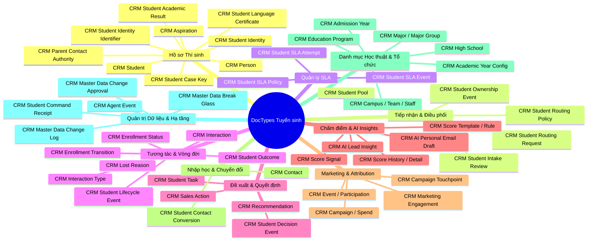
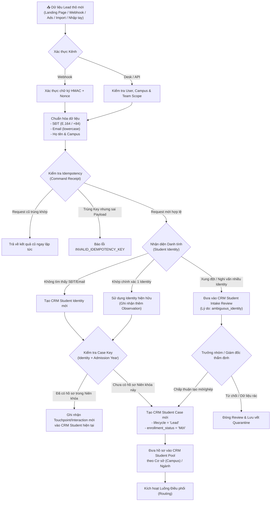
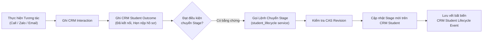
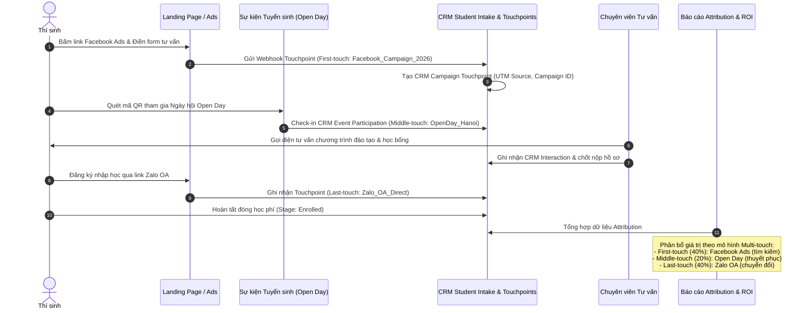
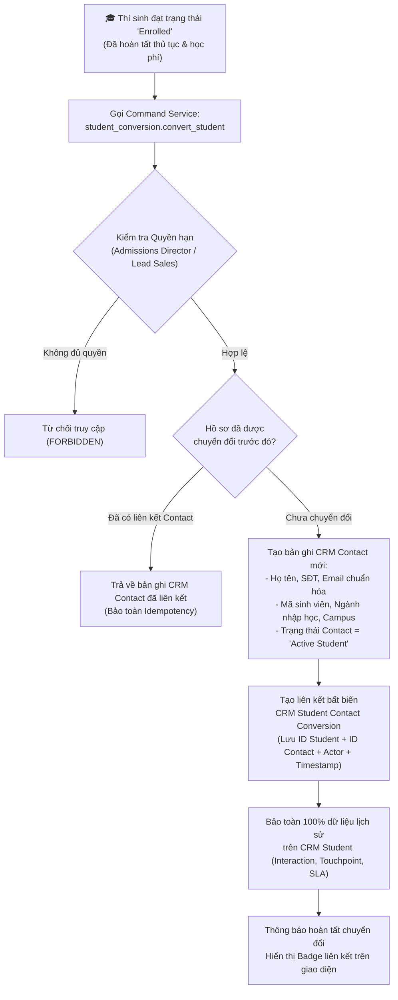
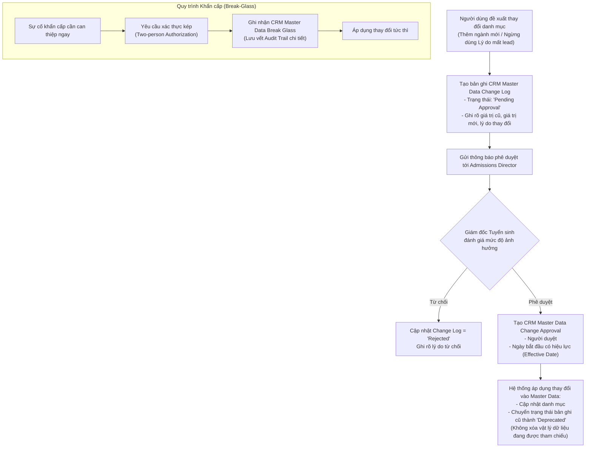

# TỔNG HỢP DOCTYPE VÀ CÁC LUỒNG NGHIỆP VỤ CRM TUYỂN SINH
*(Frappe CRM — Admissions Edition)*

---

## 1. TỔNG QUAN KIẾN TRÚC & NGUYÊN TẮC DỮ LIỆU CỐT LÕI

Hệ thống **Frappe CRM — Admissions Edition** được thiết kế chuyên biệt cho khối Giáo dục & Tuyển sinh (Đại học, Cao đẳng, Đào tạo nghề), vận hành trên nguyên tắc lấy **Hồ sơ Tuyển sinh (`CRM Student`) làm thực thể trung tâm** thay vì `CRM Contact` như CRM bán hàng thông thường.

```mermaid
flowchart LR
    subgraph MKT ["🎯 Marketing & Nguồn"]
        C["Campaign & Ads"]
        E["Event Tuyển sinh"]
        W["Website / Form / Zalo"]
    end

    subgraph INTAKE ["📥 Tiếp nhận & Chống trùng"]
        ID["Student Identity"]
        REV["Intake Review"]
        CASE["Student Case Key"]
    end

    subgraph SALES ["🔥 Điều phối & Tư vấn"]
        POOL["Student Pool"]
        ROUT["Routing Policy"]
        SLA["First-response SLA"]
        CARE["Interaction & Outcome"]
    end

    subgraph CONV ["🎓 Nhập học & Quản trị"]
        ENR["Enrolled Stage"]
        CONVERT["Student Contact Conversion"]
        CONTACT["CRM Contact"]
    end

    MKT -->|Touchpoint / Participation| INTAKE
    INTAKE -->|Case tạo mới| SALES
    SALES -->|Đạt chỉ tiêu| CONV
```



### 4 Nguyên tắc Dữ liệu Bất biến (Core Invariants)
1. **Active Responsibility Invariant:** Một `CRM Student` tại một thời điểm bắt buộc phải thuộc về **1 Chuyên viên tư vấn (`owner_staff`)** hoặc nằm trong **1 Hàng đợi chờ phân công (`CRM Student Pool`)**. Tuyệt đối không có hồ sơ mồ côi.
2. **Append-Only History:** Không bao giờ ghi đè lịch sử. Phân công (`Ownership Event`), chuyển trạng thái (`Lifecycle Event`), biến động SLA (`SLA Event`), nhật ký chăm sóc (`Interaction`) và kết quả (`Outcome`) đều được lưu trữ thành chuỗi sự kiện độc lập phục vụ Audit và dựng Timeline.
3. **Idempotency qua Command Receipt:** Mọi thao tác ghi nhận quan trọng đều tạo biên nhận (`CRM Student Command Receipt`) và kiểm soát phiên bản (CAS / Revision) để chống trùng lặp dữ liệu do gửi lại request hoặc lag mạng.
4. **Tách biệt Student & Contact:** `CRM Student` là hồ sơ tuyển sinh vận hành; chỉ khi đạt trạng thái nhập học (`Enrolled`) mới kích hoạt liên kết sang `CRM Contact`.

---

## 2. BẢNG PHÂN LOẠI CHI TIẾT CÁC DOCTYPE TUYỂN SINH

Hệ thống quản lý hơn 60 DocType nghiệp vụ tuyển sinh, được chia thành **10 nhóm chức năng**:



### Nhóm 1: Thực thể Cốt lõi & Hồ sơ Học sinh (Core Student & Academic Profile)
| Tên DocType | Phân loại | Mục đích & Vai trò nghiệp vụ |
|---|---|---|
| `CRM Student` | Core State | Thực thể trung tâm quản lý 1 ca tuyển sinh của thí sinh trong 1 niên khóa. Chứa thông tin liên hệ, trạng thái tuyển sinh, điểm số, chuyên viên phụ trách. |
| `CRM Student Identity` | Identity | Bản ghi danh tính duy nhất của một cá nhân, dùng làm mỏ neo nhận diện chống trùng lặp qua số điện thoại/email chuẩn hóa. |
| `CRM Student Identity Identifier` | Child Table | Danh sách các định danh liên kết với Identity (SĐT chính, SĐT phụ, Email cá nhân, Mã định danh/CCCD). |
| `CRM Student Case Key` | Unique Constraint | Khóa nghiệp vụ duy nhất xác định cặp `Identity + Admission Year` (mỗi thí sinh chỉ có 1 ca tuyển sinh đang hoạt động trong 1 niên khóa). |
| `CRM Person` | Master Data | Lưu thông tin cá nhân mở rộng (ngày sinh, giới tính, dân tộc, nơi sinh, địa chỉ thường trú). |
| `CRM Aspiration` | Student Profile | Nguyện vọng đăng ký của thí sinh (Ngành học ưu tiên 1, Ngành 2, Cơ sở mong muốn, Hệ đào tạo, Phương thức xét tuyển). |
| `CRM Student Academic Result` | Student Profile | Kết quả học tập: Điểm học bạ THPT (lớp 10, 11, 12), Điểm thi tốt nghiệp THPT theo tổ hợp môn, Điểm thi Đánh giá năng lực (ĐHQG/ĐH Bách Khoa). |
| `CRM Student Language Certificate` | Student Profile | Chứng chỉ ngoại ngữ (IELTS, TOEFL, TOEIC, JLPT, HSK, TOPIK...) phục vụ xét tuyển thẳng, cộng điểm ưu tiên hoặc xét học bổng. |
| `CRM Parent Contact Authority` | Student Profile | Thông tin phụ huynh (Bố, Mẹ, Người giám hộ), số điện thoại, nghề nghiệp và quyền quyết định tài chính/nhập học. |

### Nhóm 2: Tiếp nhận & Điều phối Hồ sơ (Intake, Deduplication & Routing)
| Tên DocType | Phân loại | Mục đích & Vai trò nghiệp vụ |
|---|---|---|
| `CRM Student Intake Review` | Review Queue | Hàng đợi lưu các ca tiếp nhận nghi vấn trùng lặp danh tính, xung đột thông tin hoặc thiếu dữ liệu cần Trưởng nhóm / Giám đốc Tuyển sinh thẩm định thủ công. |
| `CRM Student Pool` | State Queue | Nhóm/hàng đợi hồ sơ chưa phân công, gom theo từng Campus hoặc Phân nhóm tuyển sinh (ví dụ: Pool Hà Nội - Khối Kỹ thuật, Pool TP.HCM - Hotline). |
| `CRM Student Routing Policy` | Policy Rule | Quy tắc điều phối tự động: Phân bổ xoay vòng (Round-robin), phân bổ theo trọng số hiệu suất, phân bổ theo khu vực địa lý/trường THPT hoặc chuyên môn ngành của Sales. |
| `CRM Student Routing Request` | Routing Queue | Hàng đợi lưu yêu cầu điều phối đang chờ xử lý (deferred) khi chưa tìm được tư vấn viên phù hợp hoặc ngoài giờ làm việc. |
| `CRM Student Ownership Event` | Business History | Nhật ký bất biến (append-only) ghi nhận lịch sử chuyển giao hồ sơ: Ai giao, giao cho ai, thuộc Team nào, thời điểm và lý do chuyển giao. |

### Nhóm 3: Quản lý SLA Phản hồi (Service Level Agreement)
| Tên DocType | Phân loại | Mục đích & Vai trò nghiệp vụ |
|---|---|---|
| `CRM Student SLA Policy` | Policy Rule | Định nghĩa cam kết thời gian phản hồi đầu tiên (First Meaningful Response SLA) theo từng kênh/nguồn, mốc cảnh báo (Warn: ví dụ trước 30p), mốc vi phạm (Breach) và leo thang (Escalate). |
| `CRM Student SLA Attempt` | Active State | Phiên theo dõi SLA đang chạy cho 1 hồ sơ cụ thể kể từ khi Sales nhận bàn giao từ Pool. |
| `CRM Student SLA Event` | Business History | Lịch sử các mốc sự kiện SLA: Kích hoạt (Started), Cảnh báo sắp trễ (Warning), Vi phạm quá hạn (Breached), Báo cáo vượt cấp (Escalated), Hoàn tất (Completed), Tạm dừng/Đặt lại (Paused/Reset). |

### Nhóm 4: Tương tác, Chăm sóc & Vòng đời Tuyển sinh (Engagement & Lifecycle)
| Tên DocType | Phân loại | Mục đích & Vai trò nghiệp vụ |
|---|---|---|
| `CRM Interaction` | Business History | Lịch sử chăm sóc đa kênh (Cuộc gọi tổng đài VoIP, Tin nhắn Zalo OA/SMS, Email, Buổi tư vấn trực tiếp tại trường/văn phòng). Bằng chứng để hoàn thành SLA và chuyển giai đoạn. |
| `CRM Interaction Type` | Master Data | Danh mục phân loại kênh tương tác (Cuộc gọi đến, Cuộc gọi đi, Zalo chat, Gặp trực tiếp, Email marketing). |
| `CRM Student Outcome` | Business History | Kết quả có ý nghĩa sau mỗi lần tương tác (ví dụ: Đã kết nối - Quan tâm ngành CNTT, Hẹn nộp học bạ ngày mai, Thuê bao không liên lạc được, Sai số). |
| `CRM Student Lifecycle Event` | Business History | Lịch sử chuyển giai đoạn tuyển sinh: Lưu trạng thái trước, trạng thái sau, người thực hiện, lý do và tài liệu/tương tác làm căn cứ chuyển đổi. |
| `CRM Enrollment Status` | Master Data | Danh mục trạng thái chi tiết theo từng giai đoạn (ví dụ: Mới, Đang liên hệ, Tiềm năng cao, Đã nộp hồ sơ, Đã trúng tuyển, Đã đóng học phí, Đã hủy). |
| `CRM Enrollment Transition` | Rule Config | Ma trận định nghĩa các bước chuyển trạng thái hợp lệ (tránh nhảy cóc trạng thái trái quy định). |
| `CRM Lost Reason` | Master Data | Danh mục lý do thất bại/mất lead có kiểm soát (Học phí cao, Chọn trường khác, Không đỗ tốt nghiệp THPT, Không đúng ngành mong muốn, Phụ huynh không đồng ý). |

### Nhóm 5: Đề xuất, Quyết định & Công việc (Recommendation, Decision & Tasks)
| Tên DocType | Phân loại | Mục đích & Vai trò nghiệp vụ |
|---|---|---|
| `CRM Recommendation` | Current State | Đề xuất hành động tiếp theo cho hồ sơ (được gợi ý bởi AI, Luật hệ thống hoặc chỉ đạo từ Trưởng nhóm Tuyển sinh). |
| `CRM Sales Action` | Current State | Nhiệm vụ tư vấn cụ thể mà Sales đã chấp nhận thực hiện (có hạn chót `due_date`, người phụ trách và trạng thái hoàn thành). |
| `CRM Student Decision Event` | Business History | Lịch sử phản hồi đề xuất: Chấp nhận (Accept $\rightarrow$ sinh ra Action), Từ chối (Reject kèm lý do), Hoãn lại (Snooze). |
| `CRM Student Task` / `Task` | Work Item | Công việc/lịch hẹn cần làm với thí sinh (gọi lại, chuẩn bị hồ sơ xét học bổng, gửi giấy báo). |

### Nhóm 6: Chấm điểm Tiềm năng & AI Insights (Scoring & AI Insights)
| Tên DocType | Phân loại | Mục đích & Vai trò nghiệp vụ |
|---|---|---|
| `CRM Score Template` / `CRM Score Rule` | Rule Config | Bộ quy tắc tính điểm tiềm năng của thí sinh dựa trên thuộc tính (Trường THPT chuyên, Điểm GPA cao, Khu vực tuyển sinh trọng điểm) và hành vi (Tham gia Open Day, Tương tác Zalo nhiều lần). |
| `CRM Negative Score Rule` | Rule Config | Quy tắc trừ điểm (gọi 3 lần không nghe máy, từ chối tham gia tư vấn). |
| `CRM Time Decay Config` | Rule Config | Cấu hình giảm điểm tiềm năng theo thời gian thí sinh không có tương tác mới. |
| `CRM Score History` / `CRM Score History Detail` | History Log | Lịch sử biến động điểm số của thí sinh qua từng mốc thời gian và chi tiết các tiêu chí cộng/trừ điểm. |
| `CRM Score Signal` / `CRM Score Input Change` | System Event | Ghi nhận các tín hiệu đầu vào mới kích hoạt tính toán lại điểm tiềm năng. |
| `CRM AI Lead Insight` | AI Analytics | Tổng hợp phân tích AI về hồ sơ thí sinh: Mức độ quan tâm, Ngành học tiềm năng nhất, Dự báo xác suất nhập học. |
| `CRM AI Lead Insight (Interest / Objection / Risk Flag)` | AI Child Tables | Chi tiết về: Điểm yêu thích của thí sinh, Rào cản/băn khoăn (học phí, vị trí xa), và Cảnh báo nguy cơ rớt hồ sơ sang trường đối thủ. |
| `CRM AI Personal Email Draft` | AI Assistant | Bản nháp email/tin nhắn tư vấn được AI cá nhân hóa riêng theo bối cảnh và tâm lý của thí sinh để Sales duyệt trước khi gửi. |

### Nhóm 7: Marketing, Sự kiện & Phân bổ Đa kênh (Marketing & Attribution)
| Tên DocType | Phân loại | Mục đích & Vai trò nghiệp vụ |
|---|---|---|
| `CRM Campaign` / `CRM Campaign Type` | Campaign Master | Quản lý các chiến dịch marketing tuyển sinh (Quảng cáo số Google/Facebook/TikTok, Tuyển sinh trực tiếp tại các trường THPT - School Tour, Ngày hội tư vấn tuyển sinh). |
| `CRM Campaign Spend` | Financial | Ghi nhận chi phí thực tế của chiến dịch theo từng đợt để tính toán CPL (Cost Per Lead), CPA (Cost Per Acquisition) và ROI. |
| `CRM Campaign Touchpoint` | Attribution History | Ghi nhận từng điểm chạm của học sinh với chiến dịch (quét mã QR tờ rơi, bấm link quảng cáo, điền form landing page). |
| `CRM Event` | Event Master | Quản lý sự kiện tuyển sinh: Ngày hội trải nghiệm (Open Day), Hội thảo hướng nghiệp trực tuyến (Webinar), Kỳ thi thử ĐGNL. |
| `CRM Event Participation` | Attribution History | Nhật ký tham gia sự kiện của thí sinh: Đã đăng ký (Registered), Đã check-in (Attended), Vắng mặt (No-show), Đánh giá sau sự kiện (Feedback). |
| `CRM Marketing Engagement` | History Log | Tổng hợp các hoạt động tương tác marketing chung của thí sinh. |

### Nhóm 8: Nhập học & Chuyển đổi Khách hàng (Conversion)
| Tên DocType | Phân loại | Mục đích & Vai trò nghiệp vụ |
|---|---|---|
| `CRM Student Contact Conversion` | Junction / History | Bản ghi liên kết chuyển đổi an toàn 1-1 giữa `CRM Student` và `CRM Contact` khi thí sinh hoàn tất thủ tục nhập học (`Enrolled`). |
| `CRM Contact` | Core Entity | Hồ sơ liên hệ chính thức sau chuyển đổi (sẵn sàng kết nối với hệ thống Đào tạo / SIS / Quản lý Sinh viên). |
| `CRM Student Contact Conversion Reconciliation` | Audit Log | Đối soát và kiểm tra tính toàn vẹn của các ca chuyển đổi, ngăn ngừa trùng lặp Contact. |

### Nhóm 9: Danh mục Học thuật & Cơ cấu Vận hành (Master Data & Organization)
| Tên DocType | Phân loại | Mục đích & Vai trò nghiệp vụ |
|---|---|---|
| `CRM Campus` | Org Master | Danh mục Cơ sở đào tạo (Campus Hà Nội, Campus TP.HCM, Campus Đà Nẵng, Campus Cần Thơ...). |
| `CRM Team` / `CRM Team Membership` | Org Master | Đội ngũ làm việc: Phòng Tuyển sinh, Tổ Marketing, Đội Tư vấn Sales 1, Đội Hotline và danh sách nhân sự trực thuộc. |
| `CRM Staff` | Org Master | Hồ sơ nhân sự gắn liền với User hệ thống, Vai trò (Role) và Cơ sở (Campus) phụ trách. |
| `CRM Admission Year` | Academic Master | Niên khóa / Kỳ tuyển sinh (ví dụ: Khóa Tuyển sinh 2026, Khóa Tuyển sinh 2027, Tuyển sinh Đợt 1). |
| `CRM Major Group` / `CRM Major` | Academic Master | Khối ngành (Khối Công nghệ, Khối Kinh tế, Khối Ngôn ngữ) và Chuyên ngành đào tạo chi tiết (Kỹ thuật phần mềm, Trí tuệ nhân tạo, Kinh doanh quốc tế). |
| `CRM Education Program` | Academic Master | Hệ đào tạo (Đại học chính quy, Chương trình chất lượng cao, Liên kết quốc tế, Cao đẳng, Văn bằng 2). |
| `CRM Academic Year Config` | Academic Policy | Cấu hình học thuật theo niên khóa: chứa các bảng con quy định Học phí (`CRM Tuition Policy Item`), Quỹ học bổng (`CRM Scholarship Item`), Chỉ tiêu tuyển sinh (`CRM Quota Item`). |
| `CRM High School` / `CRM School Type` | Master Data | Danh mục các trường THPT trên toàn quốc, mã trường, phân loại trường (THPT Chuyên, Công lập, Dân lập, Trung tâm GDTX) phục vụ định tuyến và phân tích nguồn tuyển. |
| `CRM Province` / `CRM Ward` / `CRM Region` | Geography | Danh mục địa lý hành chính phục vụ phân bổ thị trường và tuyển sinh theo khu vực. |

### Nhóm 10: Quản trị Thay đổi Dữ liệu & Hạ tầng Kỹ thuật (Governance & Infrastructure)
| Tên DocType | Phân loại | Mục đích & Vai trò nghiệp vụ |
|---|---|---|
| `CRM Master Data Change Log` | Governance | Bản ghi đề xuất sửa đổi/ngừng sử dụng danh mục dùng chung (Nguồn, Ngành, Campus, Lý do mất lead). |
| `CRM Master Data Change Approval` | Governance | Lịch sử phê duyệt thay đổi danh mục từ Ban Giám đốc Tuyển sinh. |
| `CRM Master Data Break Glass` | Security Audit | Cơ chế cấp quyền can thiệp khẩn cấp có kiểm soát kép (*Two-person rule*) và ghi log kiểm toán. |
| `CRM Student Command Receipt` | Technical / Cache | Biên nhận chống trùng lặp xử lý lệnh (Idempotency Key Receipt). |
| `CRM Agent Event` | Outbox Queue | Hàng đợi sự kiện dùng chung (Shared Outbox) phục vụ gửi thông báo ngầm, tích hợp webhook và retry tự động. |

---

## 3. CÁC LUỒNG NGHIỆP VỤ CỐT LÕI (CORE BUSINESS WORKFLOWS)

---

### LUỒNG 1: TIẾP NHẬN LEAD THÔ & CHỐNG TRÙNG HỒ SƠ (INTAKE & DEDUPLICATION)

Mọi luồng dữ liệu học sinh đầu vào đều bắt buộc đi qua **Canonical Student Intake Service**, tuyệt đối không cho phép tạo trực tiếp `CRM Student`.



#### Quy tắc nghiệp vụ xử lý:
- **Chuẩn hóa số điện thoại:** Số điện thoại được tự động làm sạch (bỏ khoảng trắng, chuyển về chuẩn quốc tế `+84` hoặc chuẩn nội địa 10 chữ số) để so khớp.
- **Không dùng CCCD để ghép hồ sơ:** CCCD/CMND chỉ mang tính chất tham khảo bổ sung, không dùng làm khóa chính để tự động ghép hồ sơ.
- **Hồ sơ chờ duyệt (`Intake Review`):** Khi một số điện thoại trùng với 2 danh tính khác nhau hoặc thông tin họ tên mâu thuẫn lớn, hệ thống tự động cách ly vào hàng đợi `CRM Student Intake Review` để con người xử lý, tránh ghi đè làm sai lệch dữ liệu.

---

### LUỒNG 2: ĐIỀU PHỐI HỒ SƠ & THEO DÕI HẠN PHẢN HỒI (ROUTING & SLA)

Hồ sơ sau khi vào Pool sẽ được điều phối tự động đến Chuyên viên Tư vấn (Sales) và kích hoạt phiên cam kết thời gian phản hồi đầu tiên.

```mermaid
flowchart TD
    IN_POOL["📥 Hồ sơ nằm trong CRM Student Pool"] --> GET_POLICY["Truy xuất CRM Student Routing Policy\ntheo Campus & Đội tuyển sinh"]

    GET_POLICY --> CHECK_STAFF{"Có Sales đủ điều kiện?\n(Active, trong ca trực, chưa quá tải)"}
    CHECK_STAFF -->|Không có Sales| DEFER["Tạo CRM Student Routing Request (Deferred)\nChờ Scheduler retry hoặc phân bổ thủ công"]
    CHECK_STAFF -->|Có danh sách Sales| ROUND_ROBIN["Chọn Sales theo cơ chế Round-robin / Trọng số"]

    ROUND_ROBIN --> ASSIGN_CMD["Thực thi Lệnh Phân công (Ownership Command)"]
    ASSIGN_CMD --> SET_OWNER["Cập nhật CRM Student:\n- owner_staff = Sales được chọn\n- owning_team = Sales Team tương ứng"]
    ASSIGN_CMD --> LOG_OWNER["Ghi bản ghi bất biến\nCRM Student Ownership Event"]

    SET_OWNER --> START_SLA["Khởi tạo CRM Student SLA Attempt\n(First Meaningful Response)"]
    START_SLA --> NOTIF_SALES["Gửi thông báo đẩy / Realtime Socket\nđến màn hình Sales: 'Cần liên hệ ngay'"]

    NOTIF_SALES --> WAIT_ACTION["Sales tiếp nhận & xử lý"]

    WAIT_ACTION --> TIMER{"Bộ đếm thời gian SLA Policy"}
    TIMER -->|Còn 30 phút| SLA_WARN["SLA Warning:\nCảnh báo màu vàng trên giao diện Sales"]
    TIMER -->|Quá hạn (Breached)| SLA_BREACH["SLA Breached:\n- Đổi trạng thái SLA = 'Breached'\n- Gửi cảnh báo đỏ tới Lead Sales"]
    SLA_BREACH --> SLA_ESC["SLA Escalated:\nĐưa vào Báo cáo vi phạm hàng ngày\ngửi Admissions Director"]

    WAIT_ACTION --> DO_INTERACTION["Sales thực hiện Cuộc gọi / Gửi Zalo / Email"]
    DO_INTERACTION --> LOG_INTERACTION["Ghi nhận CRM Interaction hợp lệ\nkèm CRM Student Outcome"]

    LOG_INTERACTION --> CLOSE_SLA["Đóng SLA Attempt:\n- Cập nhật trạng thái = 'Completed'\n- Ghi nhận CRM Student SLA Event (completed)"]
```

#### Quy tắc nghiệp vụ SLA:
- **First Meaningful Response:** Chỉ những tương tác có kết quả rõ ràng (`CRM Student Outcome`) từ kênh được xác thực (cuộc gọi tổng đài, tin nhắn gửi thành công) mới được tính là hoàn tất SLA.
- **Tạm dừng / Đặt lại SLA:** Chỉ được thực hiện khi có lý do chính đáng (ví dụ: ngoài giờ hành chính, thí sinh hẹn gọi lại sau giờ học) và phải được cấu hình trong `CRM Student SLA Policy`.

---

### LUỒNG 3: CHĂM SÓC, TƯ VẤN & TIẾN TRÌNH VÒNG ĐỜI (ENGAGEMENT & LIFECYCLE)

Hành trình chăm sóc học sinh trải qua các giai đoạn phễu tuyển sinh chuẩn hóa với sự kiểm soát điều kiện nghiêm ngặt:

$$\mathbf{Lead} \xrightarrow{\text{Xác nhận nhu cầu}} \mathbf{MQL} \xrightarrow{\text{Đủ điều kiện xét tuyển}} \mathbf{SQL} \xrightarrow{\text{Nộp hồ sơ xét tuyển}} \mathbf{Applicant} \xrightarrow{\text{Trúng tuyển}} \mathbf{Admitted} \xrightarrow{\text{Đóng phí nhập học}} \mathbf{Enrolled}$$

```mermaid
flowchart TD
    subgraph STAGES ["Các Giai đoạn Tuyển sinh (Lifecycle Stages)"]
        S_LEAD["1. Lead\n(Hồ sơ mới tiếp nhận)"]
        S_MQL["2. MQL - Marketing Qualified\n(Đúng số, đúng đối tượng, có nhu cầu)"]
        S_SQL["3. SQL - Sales Qualified\n(Xác định ngành, phụ huynh đồng thuận, khả thi)"]
        S_APP["4. Applicant\n(Đã nộp hồ sơ xét tuyển / học bạ)"]
        S_ADM["5. Admitted\n(Đạt điểm chuẩn, nhận Giấy báo trúng tuyển)"]
        S_ENR["6. Enrolled\n(Đã hoàn tất học phí, nhập học chính thức)"]
        S_LOST["❌ Lost\n(Dừng chăm sóc / Không quan tâm)"]
        S_NUR["🌱 Nurture\n(Nuôi dưỡng dài hạn cho năm sau)"]
    end

    S_LEAD -->|Tương tác kết nối thành công| S_MQL
    S_MQL -->|Xác nhận ngành + khả năng tài chính| S_SQL
    S_SQL -->|Thu đủ hồ sơ xét tuyển / lệ phí| S_APP
    S_APP -->|Hội đồng tuyển sinh duyệt trúng tuyển| S_ADM
    S_ADM -->|Xác nhận đóng học phí nhập học| S_ENR

    S_LEAD -.->|Không có nhu cầu / Sai số| S_LOST
    S_MQL -.->|Chọn trường khác / Học phí cao| S_LOST
    S_SQL -.->|Trượt tốt nghiệp / Gia đình đổi ý| S_LOST

    S_LEAD -.->|Học sinh lớp 10, 11 chưa đến tuổi| S_NUR
    S_LOST -.->|Có nhu cầu trở lại (Kèm lý do)| S_MQL
```



#### Quy tắc nghiệp vụ Vòng đời:
- **Không nhảy cóc không có bằng chứng:** Để chuyển sang `Applicant`, bắt buộc phải có thông tin ngành nguyện vọng (`CRM Aspiration`) và kết quả học tập (`CRM Student Academic Result`).
- **Rẽ nhánh Lost bắt buộc có lý do:** Khi chuyển hồ sơ sang `Lost`, Sales bắt buộc phải chọn `CRM Lost Reason` và ghi chú giải trình. Mọi trường hợp mở lại hồ sơ `Lost` đều phải thông qua phê duyệt của Lead Sales.

---

### LUỒNG 4: ĐỀ XUẤT, NHẬN VIỆC & RA QUYẾT ĐỊNH (RECOMMENDATION & ACTION)

Mô hình tách bạch rõ 3 khái niệm: **Đề xuất (Recommendation) $\rightarrow$ Quyết định (Decision) $\rightarrow$ Thực hiện (Action) $\rightarrow$ Kết quả (Outcome)**.

```mermaid
flowchart TD
    TRIGGER["Sự kiện kích hoạt\n(Học sinh xem học bổng / AI phân tích / Lead Sales giao việc)"]
    TRIGGER --> REC["Tạo CRM Recommendation:\n'Đề xuất gọi tư vấn Học bổng 50% ngành CNTT'"]

    REC --> WORKLIST["Hiển thị trên Hàng đợi Đề xuất của Sales"]

    WORKLIST --> DECISION{"Sales đưa ra Quyết định"}

    DECISION -->|Chấp nhận (Accept)| ACT_ACCEPT["Tạo CRM Sales Action:\n- Việc cần làm cụ thể\n- Gán hạn chót (due_date)\n- Trạng thái = 'Pending'"]
    DECISION -->|Từ chối (Reject)| ACT_REJECT["Ghi nhận lý do từ chối\n(Thí sinh không đủ điều kiện điểm)"]
    DECISION -->|Hoãn lại (Snooze)| ACT_SNOOZE["Hẹn nhắc lại sau N ngày"]

    ACT_ACCEPT --> LOG_DEC["Ghi nhận CRM Student Decision Event"]
    ACT_REJECT --> LOG_DEC
    ACT_SNOOZE --> LOG_DEC

    ACT_ACCEPT --> DO_TASK["Sales thực hiện công việc"]
    DO_TASK --> FINISH_ACT["Cập nhật CRM Sales Action:\nstatus = 'Completed'"]
    FINISH_ACT --> LOG_OUTCOME["Ghi nhận CRM Interaction & CRM Student Outcome"]
```

---

### LUỒNG 5: MARKETING, SỰ KIỆN & PHÂN BỔ ĐA ĐIỂM CHẠM (MULTI-TOUCH ATTRIBUTION)

Hệ thống ghi nhận toàn diện hành trình từ khi thí sinh tiếp xúc lần đầu đến khi trở thành sinh viên chính thức.



---

### LUỒNG 6: NHẬP HỌC & CHUYỂN ĐỔI SANG CONTACT (ENROLLMENT CONVERSION)

Khi thí sinh hoàn tất học phí nhập học (`Enrolled`), hệ thống kích hoạt luồng chuyển đổi an toàn sang `CRM Contact`.



---

### LUỒNG 7: QUẢN TRỊ DỮ LIỆU DÙNG CHUNG (MASTER DATA GOVERNANCE)

Bảo vệ các danh mục nền tảng (Campus, Nguồn tuyển sinh, Ngành đào tạo, Lý do mất lead) không bị sửa/xóa tùy tiện làm gãy báo cáo phân tích.



---

## 4. MA TRẬN PHÂN QUYỀN TRUY CẬP THEO VAI TRÒ (ROLE ACCESS MATRIX)

Hệ thống quản trị bảo mật **100% tại máy chủ (Server Authority)** qua `crm.fcrm.permissions`.

| Nhóm DocType | Chuyên viên Tư vấn (`Sale`) | Trưởng nhóm (`Lead Sales`) | Chuyên viên (`Marketing`) | Giám đốc Tuyển sinh (`Admissions Director`) | Quản trị viên (`System Manager`) |
|---|:---:|:---:|:---:|:---:|:---:|
| **`CRM Student`** | Chỉ xem/sửa hồ sơ được phân công (`owner_staff`) | Xem/điều phối toàn bộ hồ sơ trong Team/Campus | Chỉ xem số liệu tổng hợp (đã ẩn PII nhạy cảm) | Toàn quyền xem tất cả Campus & Can thiệp ngoại lệ | Xem cấu hình hệ thống, không sửa số liệu tuyển sinh |
| **`CRM Student Pool`** | Nhận hồ sơ từ Pool của Team mình | Quản lý, điều phối hồ sơ trong Pool | Chỉ xem số lượng lead tồn | Quản lý Pool toàn hệ thống | Quản trị cấu hình Pool |
| **`CRM Student SLA Attempt/Event`** | Xem SLA của hồ sơ mình phụ trách | Giám sát vi phạm SLA toàn Team | Không xem | Xem báo cáo SLA toàn hệ thống & Vi phạm vượt cấp | Quản trị cấu hình SLA Policy |
| **`CRM Interaction / Outcome`** | Tạo & xem tương tác của hồ sơ mình | Xem tương tác của toàn Team | Xem tương tác marketing | Xem toàn bộ tương tác hệ thống | Quản trị kỹ thuật |
| **`CRM Recommendation / Action`** | Nhận việc & cập nhật tiến độ công việc | Đề xuất việc cho Sales trong Team | Đề xuất kịch bản marketing | Giám sát hiệu suất công việc toàn viện | Quản trị kỹ thuật |
| **`CRM Campaign / Spend / Event`** | Xem thông tin sự kiện để tư vấn | Xem thông tin chiến dịch | Quản lý chiến dịch, sự kiện, chi phí | Phê duyệt ngân sách & Xem ROI | Quản trị kỹ thuật |
| **`CRM Master Data`** | Chỉ đọc danh mục (Ngành, Học phí, THPT) | Chỉ đọc danh mục | Đề xuất nguồn/platform mới | Phê duyệt thay đổi danh mục | Quản trị kỹ thuật & Người dùng |
| **`CRM Conversion`** | Chỉ xem trạng thái đã chuyển đổi | Yêu cầu chuyển đổi hồ sơ | Không xem | Phê duyệt & Đối soát chuyển đổi | Quản trị kỹ thuật |

---

## 5. TỔNG KẾT & CHECKLIST VẬN HÀNH

Tài liệu này cung cấp bức tranh toàn cảnh về mặt kiến trúc dữ liệu và quy trình nghiệp vụ của **Hệ thống CRM Tuyển sinh**. Khi xây dựng màn hình Frontend (Vue 3 SPA) hoặc mở rộng API Backend, cần tuân thủ nghiêm ngặt các nguyên tắc:

1. **Không tạo `CRM Student` trực tiếp:** Luôn đi qua `student_intake` service để đảm bảo chống trùng danh tính và idempotency.
2. **Không sửa đè lịch sử:** Mọi biến động về phân công, trạng thái, SLA, tương tác phải được ghi nhận dưới dạng Event bất biến (`Ownership Event`, `Lifecycle Event`, `SLA Event`, `Interaction`).
3. **Tuân thủ Row-level Security:** Quyền truy cập dữ liệu được lọc tự động theo phạm vi `owner_staff`, `owning_team` và `campus` tại Backend; Frontend không tự ý bypass phân quyền.
4. **Bảo vệ Master Data:** Mọi điều chỉnh danh mục dùng chung phải tuân theo quy trình Đề xuất $\rightarrow$ Phê duyệt $\rightarrow$ Áp dụng có lưu vết Audit Trail.
