# ERD backend tuyển sinh & marketing (suy ra từ mock data)

Tài liệu này chuẩn hoá mock data ở `students`, `schools`, `market-intelligence` và `campaign-intelligence` thành mô hình dữ liệu **backend**. ERD chỉ chứa dữ liệu nghiệp vụ, định danh, sự kiện và fact theo kỳ; không chứa bảng cấu hình biểu đồ hay bản ghi điểm dữ liệu cho từng biểu đồ. API dashboard tự tổng hợp các chỉ số, funnel và series biểu đồ từ các bảng này.

```mermaid
erDiagram
  PROVINCES ||--o{ DISTRICTS : contains
  USERS ||--o{ USER_ROLES : assigned
  ROLES ||--o{ USER_ROLES : grants
  USERS ||--o{ AUTH_IDENTITIES : authenticates_with
  DISTRICTS ||--o{ HIGH_SCHOOLS : contains
  PROVINCES ||--o{ FPTU_CAMPUSES : hosts
  HIGH_SCHOOLS ||--o{ SCHOOL_METRIC_SNAPSHOTS : measured_by
  HIGH_SCHOOLS ||--o{ SCHOOL_CONTACTS : has
  HIGH_SCHOOLS ||--o{ SCHOOL_RELATIONSHIPS : has
  SCHOOL_CONTACTS ||--o{ SCHOOL_RELATIONSHIPS : primary_contact
  HIGH_SCHOOLS ||--o{ SCHOOL_ACTIVITIES : hosts
  CAMPAIGNS ||--o{ SCHOOL_ACTIVITIES : drives
  USERS ||--o{ SCHOOL_ACTIVITIES : owns
  HIGH_SCHOOLS ||--o{ STUDENTS : studies_at
  MAJORS ||--o{ STUDENTS : interested_in
  USERS ||--o{ STUDENTS : owns
  STUDENTS ||--o{ STUDENT_GUARDIANS : has
  STUDENTS ||--o{ STUDENT_ACADEMICS : has
  STUDENTS ||--o{ STUDENT_ENGAGEMENT_EVENTS : creates
  CAMPAIGNS ||--o{ STUDENT_ENGAGEMENT_EVENTS : attributes
  SCHOOL_ACTIVITIES ||--o{ STUDENT_ENGAGEMENT_EVENTS : captures
  STUDENTS ||--o{ STUDENT_ASSESSMENTS : assessed_by
  USERS ||--o{ STUDENT_ASSESSMENTS : reviews
  STUDENTS ||--o{ ADMISSION_APPLICATIONS : submits
  MAJORS ||--o{ ADMISSION_APPLICATIONS : applies_for
  FPTU_CAMPUSES ||--o{ ADMISSION_APPLICATIONS : selects
  CAMPAIGN_CHANNELS ||--o{ CAMPAIGNS : publishes
  CAMPAIGNS ||--o{ CAMPAIGN_PERFORMANCE_PERIODS : measured_by
  CAMPAIGNS ||--o{ CAMPAIGN_FUNNEL_METRICS : has
  STUDENTS ||--o{ CAMPAIGN_ATTRIBUTIONS : receives
  CAMPAIGNS ||--o{ CAMPAIGN_ATTRIBUTIONS : receives

  USERS {
    uuid id PK
    string email UK
    string full_name
    string status
    datetime last_login_at
    datetime created_at
    datetime updated_at
  }
  ROLES {
    uuid id PK
    string code UK
    string name
  }
  USER_ROLES {
    uuid user_id FK
    uuid role_id FK
    datetime assigned_at
  }
  AUTH_IDENTITIES {
    uuid id PK
    uuid user_id FK
    string provider
    string provider_subject
    string provider_email
    datetime linked_at
  }

  PROVINCES {
    string code PK
    string name
    string full_name
    string region_key
    geometry multipolygon
    decimal min_longitude
    decimal min_latitude
    decimal max_longitude
    decimal max_latitude
  }
  DISTRICTS {
    string code PK
    string province_code FK
    string name
  }
  HIGH_SCHOOLS {
    uuid id PK
    string school_code UK
    string province_code FK
    string district_code FK
    string name
    string address
    string area
    boolean is_boarding_school
    string tier
    datetime created_at
    datetime updated_at
  }
  FPTU_CAMPUSES {
    uuid id PK
    string province_code FK
    string name
    string short_name
    string city
    decimal latitude
    decimal longitude
    integer current_enrolled
    integer enrollment_target
    string highlight_major
  }
  SCHOOL_METRIC_SNAPSHOTS {
    uuid id PK
    uuid school_id FK
    date measured_on
    string period_type
    integer grade12_students
    integer available_students
    integer prospects
    integer applications
    integer enrollments
    integer enrollment_forecast
    decimal potential_score
    decimal opportunity_score
    decimal conversion_rate
    decimal penetration_rate
    decimal competition_score
    decimal revenue_forecast
    decimal engagement_score
  }
  SCHOOL_CONTACTS {
    uuid id PK
    uuid school_id FK
    string full_name
    string role
    string phone
    string email
    boolean is_primary
  }
  SCHOOL_RELATIONSHIPS {
    uuid id PK
    uuid school_id FK
    uuid primary_contact_id FK
    string relationship_level
    decimal relationship_score
    datetime last_touch_at
    datetime next_touch_at
    string source_note
  }
  SCHOOL_ACTIVITIES {
    uuid id PK
    uuid school_id FK
    uuid campaign_id FK
    string activity_type
    string title
    datetime scheduled_at
    string status
    uuid owner_user_id FK
    string outcome
  }
  MAJORS {
    uuid id PK
    string code UK
    string name
    string degree_name
    boolean is_active
  }
  STUDENTS {
    uuid id PK
    string student_code UK
    uuid school_id FK
    uuid interested_major_id FK
    string full_name
    date date_of_birth
    string gender
    string phone
    string email
    string grade
    string admission_stage
    string priority
    uuid owner_user_id FK
    datetime created_at
    datetime updated_at
  }
  STUDENT_GUARDIANS {
    uuid id PK
    uuid student_id FK
    string full_name
    string relation
    string decision_role
    string involvement_level
    string preferred_channel
    string best_contact_time
    string consent_status
    datetime last_interaction_at
  }
  STUDENT_ACADEMICS {
    uuid id PK
    uuid student_id FK
    decimal gpa_grade11
    string english_qualification
    string strengths
    string interests
    string admission_method
  }
  STUDENT_ENGAGEMENT_EVENTS {
    uuid id PK
    uuid student_id FK
    uuid campaign_id FK
    uuid school_activity_id FK
    string channel
    string event_type
    string title
    string description
    datetime occurred_at
    string status
    integer signal_score_delta
  }
  STUDENT_ASSESSMENTS {
    uuid id PK
    uuid student_id FK
    datetime assessed_at
    string journey_status
    string interest_level
    string fit_level
    string primary_barrier
    decimal signal_score
    decimal enrollment_probability
    decimal confidence_score
    string recommendation
    uuid reviewed_by_user_id FK
    string review_status
  }
  ADMISSION_APPLICATIONS {
    uuid id PK
    uuid student_id FK
    uuid major_id FK
    uuid campus_id FK
    string admission_cycle
    string preference_name
    string application_status
    integer document_total
    integer document_completed
    decimal scholarship_percent
    date deadline_at
    datetime submitted_at
    datetime enrolled_at
  }
  CAMPAIGN_CHANNELS {
    uuid id PK
    string code UK
    string name
    string channel_type
  }
  CAMPAIGNS {
    uuid id PK
    uuid channel_id FK
    string code UK
    string name
    string status
    date starts_on
    date ends_on
    decimal budget_amount
    string currency_code
  }
  CAMPAIGN_PERFORMANCE_PERIODS {
    uuid id PK
    uuid campaign_id FK
    date period_start
    date period_end
    integer impressions
    integer clicks
    integer landing_visits
    integer leads
    integer qualified_leads
    integer applications
    integer enrollments
    decimal spend_amount
    decimal confirmed_revenue
    decimal pipeline_revenue
    decimal attribution_confidence
  }
  CAMPAIGN_FUNNEL_METRICS {
    uuid id PK
    uuid campaign_id FK
    date period_start
    date period_end
    integer stage_order
    string stage_key
    integer metric_count
    decimal conversion_rate
  }
  CAMPAIGN_ATTRIBUTIONS {
    uuid id PK
    uuid student_id FK
    uuid campaign_id FK
    string attribution_model
    decimal attribution_weight
    boolean is_first_touch
    datetime attributed_at
  }
```

## Quy ước kiểu dữ liệu và enum

- Số tiền: `decimal(18,2)` và `currency_code` ISO-4217, mặc định `VND`.
- Điểm/%, gồm `potential_score`, `opportunity_score`, `engagement_score`, `competition_score`, `signal_score`, `enrollment_probability`, `conversion_rate`, `penetration_rate`: `decimal(5,2)`; ràng buộc `0..100`.
- `HIGH_SCHOOLS.tier`: `tier_1 | tier_2 | tier_3`.
- `SCHOOL_RELATIONSHIPS.relationship_level`: `not_contacted | contacted | has_contact | regular_partner | strategic_partner`.
- `SCHOOL_ACTIVITIES.activity_type`: `school_visit | career_talk | workshop | parent_session | counselling`.
- `SCHOOL_ACTIVITIES.status`: `scheduled | completed | cancelled`.
- `STUDENTS.admission_stage`: `interested | exploring | counselling | applying | enrolled`.
- `STUDENTS.priority`: `high | medium | low`.
- `STUDENT_ENGAGEMENT_EVENTS.channel`: `website | event | call | zalo | application | email | social`.
- `STUDENT_ENGAGEMENT_EVENTS.status`: `completed | current | upcoming`.
- `ADMISSION_APPLICATIONS.application_status`: `not_started | in_progress | submitted | accepted | enrolled | withdrawn`.
- `CAMPAIGNS.status`: `draft | active | paused | completed | archived`.
- `CAMPAIGN_CHANNELS.channel_type`: `school_event | facebook | google | tiktok | zalo | website | referral`.

## Ghi chú chuẩn hoá từ mock data

1. `USERS`, `ROLES`, `USER_ROLES` và `AUTH_IDENTITIES` là phần định danh/phân quyền cho backend. Với đăng nhập Google, một dòng `AUTH_IDENTITIES` có `provider = google` và định danh duy nhất từ Google (`provider_subject`); không lưu access token hoặc refresh token trong ERD nghiệp vụ này.
2. `SchoolIntelligenceData` là DTO dashboard. Tách thành `HIGH_SCHOOLS`, `SCHOOL_METRIC_SNAPSHOTS`, `SCHOOL_RELATIONSHIPS`, `SCHOOL_ACTIVITIES` và các bảng học sinh; không lưu một JSON lớn duy nhất.
3. Các mảng `potentialFactors`, `engagementHealth.factors`, `scoreBands`, `postGraduationChoices`, `demographics` nên là bảng metric mở rộng khi cần truy vấn/lịch sử: `school_metric_dimensions(snapshot_id, metric_group, metric_key, label, value_number, value_text, share_percent)`.
4. `Student360Data.profile`, `family`, `readiness`, `insight`, `classification` là view/DTO được tổng hợp từ `STUDENTS`, `STUDENT_GUARDIANS`, `STUDENT_ACADEMICS`, `STUDENT_ENGAGEMENT_EVENTS`, `STUDENT_ASSESSMENTS` và `ADMISSION_APPLICATIONS`.
5. `CampaignIntelligenceResponse.summary`, `trend`, `funnel`, `roas`, `cpql`, `enrollment_rate` là số tổng hợp. Chỉ lưu số gốc theo kỳ trong `CAMPAIGN_PERFORMANCE_PERIODS` / `CAMPAIGN_FUNNEL_METRICS`; tính `ROAS = confirmed_revenue / spend`, `CPQL = spend / qualified_leads` khi đọc.
6. Các endpoint biểu đồ nhận `from`, `to`, `granularity`, `school_id`, `campaign_id`... rồi trả về DTO tổng hợp. Không tạo `charts`, `chart_series`, `chart_points`, `dashboard_widgets` hoặc lưu `chart_id` từ mock data vào cơ sở dữ liệu.
7. `SCHOOL_METRIC_SNAPSHOTS`, `CAMPAIGN_PERFORMANCE_PERIODS` và `CAMPAIGN_FUNNEL_METRICS` là fact/snapshot nghiệp vụ theo kỳ (phục vụ audit và nhập dữ liệu nguồn), không phải dữ liệu biểu đồ. Nếu tốc độ đọc chưa đủ, materialized view/cache là lớp hạ tầng triển khai, không thêm vào ERD lõi.

## Index và ràng buộc cần có

- Unique: `HIGH_SCHOOLS.school_code`, `STUDENTS.student_code`, `MAJORS.code`, `CAMPAIGNS.code`, `CAMPAIGN_CHANNELS.code`.
- Unique: `USERS.email`, `ROLES.code`, `AUTH_IDENTITIES(provider, provider_subject)`, `USER_ROLES(user_id, role_id)`.
- Unique theo kỳ: `(school_id, measured_on, period_type)` ở `SCHOOL_METRIC_SNAPSHOTS`; `(campaign_id, period_start, period_end)` ở `CAMPAIGN_PERFORMANCE_PERIODS`; `(campaign_id, period_start, period_end, stage_key)` ở `CAMPAIGN_FUNNEL_METRICS`.
- Index truy vấn chính: `STUDENTS(school_id, admission_stage, priority)`, `STUDENTS(owner_user_id, admission_stage)`, `STUDENT_ENGAGEMENT_EVENTS(student_id, occurred_at DESC)`, `ADMISSION_APPLICATIONS(student_id, application_status)`, `SCHOOL_ACTIVITIES(school_id, scheduled_at DESC)`, `SCHOOL_ACTIVITIES(owner_user_id, scheduled_at DESC)`.
- Ràng buộc: `DISTRICTS.province_code` phải khớp tỉnh của `HIGH_SCHOOLS`; `document_completed <= document_total`; chỉ một `SCHOOL_CONTACTS.is_primary = true` cho mỗi trường.
