# ERD đích — Tuyển sinh & Dashboard

Đây là ERD đích của plan [Đồng bộ DocType tuyển sinh theo ERD dashboard](../../plans/260830-1630-admissions-erd-doctype-alignment/plan.md). Nó đáp ứng dashboard tuyển sinh, marketing số/thực địa, Student 360, mục tiêu, doanh thu/dự báo, AI trust, data health và alerts theo PRD; **không** bao gồm login/auth.

Quy ước:

- `CRM ...` là DocType/fact nghiệp vụ. Các entity đánh dấu **[new]** sẽ được tạo hoặc tách rõ trong plan.
- Các entity **[read projection]** chỉ là DTO/query có quyền hạn; không tạo bảng chart/widget/series/point.
- Routing, SLA, consent, receipt và audit giữ nguyên aggregate/event hiện có. ERD hiển thị chúng khi dashboard cần đọc metric, không thay thế flow automation.
- **ERD lõi (M-01–M-12 + Student 360):** Target, Territory/Team/Capacity, Forecast/Revenue và Campaign Channel Assignment là bắt buộc. **M-16–M-18:** Model Evaluation, Data Health/Lineage và Alerts/Subscriptions là extension có điều kiện; chỉ triển khai khi các màn tương ứng nằm trong scope thật.

```mermaid
erDiagram
  CRM_REGION ||--o{ CRM_PROVINCE : contains
  CRM_PROVINCE ||--o{ CRM_WARD : contains
  CRM_PROVINCE ||--o{ CRM_PROVINCE_MAPPING : maps_old_new
  CRM_PROVINCE ||--o{ CRM_DISTRICT : optionally_groups
  CRM_WARD ||--o{ CRM_WARD_DISTRICT_CROSSWALK : maps_versioned
  CRM_DISTRICT ||--o{ CRM_WARD_DISTRICT_CROSSWALK : maps_versioned
  CRM_PROVINCE ||--o{ CRM_CAMPUS : hosts
  CRM_PROVINCE ||--o{ CRM_HIGH_SCHOOL : locates
  CRM_WARD ||--o{ CRM_HIGH_SCHOOL : locates
  CRM_DISTRICT ||--o{ CRM_HIGH_SCHOOL : reports_by

  CRM_ADMISSION_YEAR ||--o{ CRM_ACADEMIC_YEAR_CONFIG : configures
  CRM_ACADEMIC_YEAR_CONFIG ||--o{ CRM_ACADEMIC_YEAR_LINE : contains
  CRM_MAJOR ||--o{ CRM_ACADEMIC_YEAR_LINE : scopes
  CRM_CAMPUS ||--o{ CRM_ACADEMIC_YEAR_LINE : scopes

  CRM_HIGH_SCHOOL ||--o{ CRM_HIGH_SCHOOL_METRIC_SNAPSHOT : measured_by
  CRM_HIGH_SCHOOL ||--o{ CRM_SCHOOL_CONTACT : has
  CRM_SCHOOL_CONTACT ||--o{ CRM_SCHOOL_RELATIONSHIP : is_primary_contact
  CRM_HIGH_SCHOOL ||--o{ CRM_SCHOOL_RELATIONSHIP : has
  CRM_HIGH_SCHOOL ||--o{ CRM_SCHOOL_ACTIVITY : hosts
  CRM_CAMPAIGN ||--o{ CRM_SCHOOL_ACTIVITY : drives

  CRM_STUDENT_IDENTITY ||--o{ CRM_STUDENT_IDENTITY_IDENTIFIER : identifies
  CRM_STUDENT_IDENTITY ||--o{ CRM_STUDENT_CASE_KEY : scopes_case
  CRM_ADMISSION_YEAR ||--o{ CRM_STUDENT_CASE_KEY : scopes_case
  CRM_STUDENT_IDENTITY ||--o{ CRM_STUDENT : resolves
  CRM_STUDENT_CASE_KEY ||--o{ CRM_STUDENT : identifies_case
  CRM_HIGH_SCHOOL ||--o{ CRM_STUDENT : studies_at
  CRM_MAJOR ||--o{ CRM_STUDENT : current_interest
  CRM_CAMPUS ||--o{ CRM_STUDENT : current_campus
  CRM_ADMISSION_YEAR ||--o{ CRM_STUDENT : current_cycle
  CRM_STUDENT ||--o{ CRM_STUDENT_GUARDIAN : has
  CRM_CONTACT ||--o{ CRM_STUDENT_GUARDIAN : contact_identity
  CRM_STUDENT ||--o{ CRM_PARENT_CONTACT_AUTHORITY : authorizes
  CRM_CONTACT ||--o{ CRM_PARENT_CONTACT_AUTHORITY : authority_contact
  CRM_STUDENT ||--o{ CRM_STUDENT_ACADEMIC_RESULT : has
  CRM_STUDENT ||--o{ CRM_STUDENT_LANGUAGE_CERTIFICATE : has
  CRM_STUDENT ||--o{ CRM_STUDENT_ASSESSMENT : assessed_by

  CRM_STUDENT ||--o{ CRM_ADMISSION_APPLICATION : submits
  CRM_ADMISSION_YEAR ||--o{ CRM_ADMISSION_APPLICATION : applies_in
  CRM_MAJOR ||--o{ CRM_ADMISSION_APPLICATION : applies_for
  CRM_CAMPUS ||--o{ CRM_ADMISSION_APPLICATION : selects

  CRM_STUDENT ||--o{ CRM_INTERACTION : receives
  CRM_STUDENT ||--o{ CRM_MARKETING_ENGAGEMENT : touches
  CRM_STUDENT ||--o{ CRM_STUDENT_OUTCOME : has
  CRM_INTERACTION ||--o{ CRM_STUDENT_OUTCOME : evidences
  CRM_STUDENT ||--o{ CRM_STUDENT_LIFECYCLE_EVENT : transitions
  CRM_STUDENT ||--o{ CRM_STUDENT_ENGAGEMENT_EVENT : projects
  CRM_CAMPAIGN ||--o{ CRM_STUDENT_ENGAGEMENT_EVENT : attributes
  CRM_SCHOOL_ACTIVITY ||--o{ CRM_STUDENT_ENGAGEMENT_EVENT : captures

  CRM_CAMPAIGN ||--o{ CRM_CAMPAIGN_CHANNEL_ASSIGNMENT : activates
  CRM_CAMPAIGN_CHANNEL ||--o{ CRM_CAMPAIGN_CHANNEL_ASSIGNMENT : assigns
  CRM_CAMPAIGN_CHANNEL_ASSIGNMENT ||--o{ CRM_CAMPAIGN_PERFORMANCE_DIMENSION : measures
  CRM_CAMPAIGN ||--o{ CRM_CAMPAIGN_PERFORMANCE_PERIOD : measures
  CRM_CAMPAIGN_PERFORMANCE_PERIOD ||--o{ CRM_CAMPAIGN_PERFORMANCE_DIMENSION : breaks_down
  CRM_CAMPUS ||--o{ CRM_CAMPAIGN_PERFORMANCE_DIMENSION : scopes
  CRM_CAMPAIGN ||--o{ CRM_CAMPAIGN_FUNNEL_METRIC : funnels
  CRM_STUDENT ||--o{ CRM_CAMPAIGN_ATTRIBUTION : receives
  CRM_CAMPAIGN ||--o{ CRM_CAMPAIGN_ATTRIBUTION : receives
  CRM_MARKETING_ENGAGEMENT ||--o{ CRM_CAMPAIGN_ATTRIBUTION : evidence

  CRM_TERRITORY ||--o{ CRM_TERRITORY : contains
  CRM_TERRITORY ||--o{ CRM_TEAM : operates_in
  CRM_TEAM ||--o{ CRM_TEAM_MEMBERSHIP : has
  CRM_STAFF ||--o{ CRM_TEAM_MEMBERSHIP : joins
  CRM_STAFF ||--o{ CRM_STAFF_CAPACITY_PERIOD : has_capacity
  CRM_TEAM ||--o{ CRM_STAFF_CAPACITY_PERIOD : plans_capacity
  CRM_TERRITORY ||--o{ CRM_TARGET : scopes
  CRM_TEAM ||--o{ CRM_TARGET : scopes
  CRM_CAMPUS ||--o{ CRM_TARGET : scopes
  CRM_MAJOR ||--o{ CRM_TARGET : scopes
  CRM_ADMISSION_YEAR ||--o{ CRM_TARGET : sets_cycle

  CRM_ADMISSION_APPLICATION ||--o{ CRM_STUDENT_FEE_AWARD : receives
  CRM_TUITION_POLICY ||--o{ CRM_STUDENT_FEE_AWARD : grants
  CRM_SCHOLARSHIP_POLICY ||--o{ CRM_STUDENT_FEE_AWARD : grants
  CRM_ADMISSION_APPLICATION ||--o{ CRM_STUDENT_PAYMENT : pays
  CRM_STUDENT_PAYMENT ||--o{ CRM_REVENUE_RECOGNITION : recognizes
  CRM_ADMISSION_YEAR ||--o{ CRM_REVENUE_RECOGNITION : recognizes_in
  CRM_CAMPUS ||--o{ CRM_REVENUE_RECOGNITION : recognizes_at

  CRM_MODEL_VERSION ||--o{ CRM_FORECAST_RUN : executes
  CRM_FORECAST_RUN ||--o{ CRM_FORECAST_SCENARIO : contains
  CRM_FORECAST_SCENARIO ||--o{ CRM_FORECAST_VALUE : predicts
  CRM_MODEL_VERSION ||--o{ CRM_MODEL_EVALUATION : evaluates
  CRM_FORECAST_RUN ||--o{ CRM_MODEL_EVALUATION : evaluates
  CRM_TARGET ||--o{ CRM_FORECAST_VALUE : compares_to

  CRM_GEOGRAPHY_MARKET_SNAPSHOT ||--o{ CRM_MARKET_METRIC_VALUE : contains
  CRM_PROVINCE ||--o{ CRM_GEOGRAPHY_MARKET_SNAPSHOT : measures
  CRM_WARD ||--o{ CRM_GEOGRAPHY_MARKET_SNAPSHOT : measures
  CRM_TERRITORY ||--o{ CRM_GEOGRAPHY_MARKET_SNAPSHOT : measures
  CRM_DATA_SOURCE ||--o{ CRM_INGESTION_RUN : ingests
  CRM_INGESTION_RUN ||--o{ CRM_DATA_QUALITY_ISSUE : detects
  CRM_DATA_SOURCE ||--o{ CRM_METRIC_LINEAGE : supplies
  CRM_INGESTION_RUN ||--o{ CRM_METRIC_LINEAGE : supplies
  CRM_SIMULATION_REGISTRY ||--o{ CRM_FORECAST_RUN : registers

  CRM_ALERT_RULE ||--o{ CRM_ALERT_EVENT : triggers
  CRM_ALERT_EVENT ||--o{ CRM_NOTIFICATION_DELIVERY : delivers
  CRM_ALERT_EVENT ||--o{ CRM_ALERT_ACKNOWLEDGEMENT : acknowledges
  CRM_REPORT_SUBSCRIPTION ||--o{ CRM_REPORT_SUBSCRIPTION_RECIPIENT : sends_to
  CRM_REPORT_SUBSCRIPTION ||--o{ CRM_REPORT_RUN : runs
  CRM_REPORT_RUN ||--o{ CRM_NOTIFICATION_DELIVERY : delivers

  CRM_STUDENT ||--o{ CRM_STUDENT_SLA_ATTEMPT : tracked_by
  CRM_STUDENT_SLA_ATTEMPT ||--o{ CRM_STUDENT_SLA_EVENT : emits
  CRM_STUDENT ||--o{ CRM_STUDENT_OWNERSHIP_EVENT : assigned_by
  CRM_STUDENT ||--o{ CRM_STUDENT_COMMAND_RECEIPT : deduplicates
  CRM_STUDENT_ASSESSMENT ||--o{ CRM_RECOMMENDATION : informs
  CRM_RECOMMENDATION ||--o{ CRM_STUDENT_DECISION_EVENT : reviewed_by_human
```

## Entity contract

| Entity | Trạng thái | Trường chính cho UI/dashboard | Ghi chú |
|---|---|---|---|
| `CRM Province`, `CRM Ward`, `CRM Province Mapping` | Giữ | code, name, region, effective mapping | Canonical geography theo PRD; hỗ trợ xem đơn vị cũ/mới. |
| `CRM District`, `CRM Ward District Crosswalk` | **[new, conditional]** | code, province, effective period | Chỉ thêm khi UI cần district; không thay `Ward`. |
| `CRM Campus` | Mở rộng | code, city, lat/lng, current enrolled, target, highlight major | Map/capacity dashboard. |
| `CRM Major` | Mở rộng | code, name, degree name, active | Filter ngành và quota. |
| `CRM High School` | Mở rộng | code, geography, tier, boarding, area | Drill-down thị trường. |
| `CRM High School Metric Snapshot` | Mở rộng từ Annual Snapshot | measured_on, period_type, grade-12, prospects, applications, enrollments, scores/rates/forecasts | Grain: school + date + period type. Giữ `ne_*`, verification và provenance cũ. |
| `CRM School Contact` | **[new]** | name, role, phone, email, is_primary | Một primary contact/trường. |
| `CRM School Relationship` | **[new]** | level, score, last/next touch, source note | Quan hệ trường/đầu mối, không thay `CRM Person` đa dụng. |
| `CRM School Activity` | Mở rộng | campaign, title, scheduled_at, status, owner/team, outcomes | Marketing thực địa. |
| `CRM Student` | Giữ + projection fields | identity/case, school, campus, current interest, owner/team/pool, priority, operational lifecycle | Aggregate intake/ownership/lifecycle; không chứa nhiều application. |
| `CRM Student Guardian` | **[new]** | contact, relation, decision role, involvement, channel, best time, consent summary | Student 360 read/write profile. `Parent Contact Authority` vẫn là evidence consent/authority. |
| `CRM Student Academic Result`, Language Certificate | Giữ | GPA/grade, certificate | Chi tiết học lực; Student 360 tổng hợp thành academic DTO. |
| `CRM Student Assessment` | Mở rộng | score 0–100, probability, interest/fit/barrier, reason, model/policy, review status | AI/human insight versioned; không sở hữu lifecycle/owner/application. |
| `CRM Admission Application` | **[new]** | student, year, major, campus, preference, method, status, docs, scholarship, deadline, submitted/enrolled | Grain: một nguyện vọng/hồ sơ; source cho funnel application/enrollment. |
| `CRM Interaction`, Marketing Engagement, Outcome | Giữ | channel, direction, content/source, occurred/touched time, outcome | Evidence nguồn; append-only/superseding theo contract hiện có. |
| `CRM Student Engagement Event` | **[new fact/read boundary]** | student, campaign/activity, channel, type, title, occurred_at, status, score delta, source reference | Canonical timeline/dashboard fact. Không thay Interaction/Event Participation. |
| `CRM Campaign Channel` | **[new canonical master]** | code, name, type | Adapter/migration từ Platform, Lead Source, Term. |
| `CRM Campaign Channel Assignment` | **[new junction]** | campaign, channel, landing page/form, active period, UTM/attribution defaults | Một Campaign chạy nhiều channel đồng thời; thay quan hệ one-to-many Campaign → Channel. |
| `CRM Campaign` | Mở rộng | code, dates, status, budget, campus, UTM | Campaign master; channel đi qua Assignment, giữ owner/KPI operational metadata. |
| `CRM Campaign Performance Period` | **[new fact]** | campaign, period, impressions, clicks, visits, leads, qualified, applications, enrollments, spend, confirmed/pipeline revenue | Grain tổng theo campaign + period; raw measure only. |
| `CRM Campaign Performance Dimension` | **[new fact child]** | period, campus, channel, lead source, landing page/form, metrics | Cho daily/source/platform/campaign/campus và so sánh form/landing page mà không ghi đè period tổng. |
| `CRM Campaign Funnel Metric` | **[new fact]** | campaign, period, dimension key, stage/order, count, conversion | Funnel versioned; denominator và stage mapping phải truy vết được. |
| `CRM Campaign Attribution` | **[new fact]** | student, campaign, model, weight, first touch, attributed_at, evidence | Không mất `CRM Marketing Engagement`/event check-in source. |
| `CRM Territory` | **[new master]** | code, name, parent territory, geography scope, effective period | Scope phân quyền và hiệu suất vùng; không suy ra territory từ text address. |
| `CRM Team`, `CRM Team Membership` | Giữ/mở rộng | team, staff, role, territory, active/effective dates | Quan hệ team/staff truy vết được cho workload, performance và RLS. |
| `CRM Staff Capacity Period` | **[new fact]** | staff/team, period, planned/available capacity, leave/override reason | Không dùng số lead hiện tại để suy đoán capacity. |
| `CRM Target` | **[new versioned fact]** | admission year, period, metric, target value, scope type/id, version, approved at | Scope toàn quốc/vùng/campus/team/major; không overwrite target đã phê duyệt. |
| `CRM Tuition Policy`, Scholarship/Discount Award` | Giữ/mở rộng | policy/version, award/discount, application, eligibility/approval | Giải thích net revenue; không chỉ lưu scholarship % summary trên Application. |
| `CRM Student Payment`, `CRM Revenue Recognition` | **[new facts]** | application, payment, recognized amount/date, campus/cycle, status | Doanh thu thực và ghi nhận doanh thu tách khỏi campaign revenue/forecast. |
| `CRM Model Version` | **[new master]** | model/prompt/policy version, owner, approval, active range | Reproducibility cho AI/forecast; không lưu secret/model credential. |
| `CRM Forecast Run`, `CRM Forecast Scenario`, `CRM Forecast Value` | **[new facts]** | run/as-of, horizon, scope, scenario, predicted value, lower/upper bound, confidence, model version | Dự báo M-13 theo scope/kỳ; immutable run, không overwrite actual. |
| `CRM Model Evaluation` | **[optional: M-16]** | model/run, cohort, metric, actual vs predicted, error/quality | AI Trust; so sánh trên cohort đã đóng. |
| `CRM Geography Market Snapshot`, Market Metric Value` | **[optional: M-02/M-09]** | geography, period, source, market size/segment values, coverage/confidence | Chỉ cần khi dashboard cần market-size độc lập danh mục trường THPT. |
| `CRM Data Source`, Ingestion Run, Data Quality Issue` | **[optional: M-17]** | source, run, freshness, row count, status, issue/severity/owner | Data Health; raw payload vẫn ở ingress/retention boundary. |
| `CRM Metric Lineage`, Simulation Registry` | **[optional: M-16/M-17]** | metric/DTO, source/run, transform/version, simulation/run | Truy vết số liệu và tách output mô phỏng khỏi actual. |
| `CRM Alert Rule`, Alert Event, Acknowledgement` | **[optional: M-18]** | condition/scope/version, event, severity, actor/time/decision | Alert; rule không tự ghi đè dữ liệu nghiệp vụ. |
| `CRM Report Subscription`, Recipient, Report Run` | **[optional: M-18]** | report/DTO, schedule, scope, recipient, run/status | Delivery có scope/consent/audit, không hard-code email list. |
| `CRM Student SLA Attempt/Event` | Giữ | due/warn/breach/responded timestamps, state, policy | Không đổi automation. Là nguồn projection overdue/compliance. |
| `CRM Student Ownership Event`, Lifecycle Event, Command Receipt | Giữ | actor, before/after, time, correlation/idempotency | Audit và đúng-ngữ-nghĩa workflow. |
| Recommendation, Student Decision Event, Agent Event | Giữ | proposal, reviewer, decision, outcome, input/knowledge reference | Chuỗi audit AI/human; không tạo generic event store. |

## Lifecycle và funnel

Hai vocabulary cùng tồn tại có chủ đích:

| Operational lifecycle | Dashboard funnel | Quy tắc |
|---|---|---|
| `Lead` | `interested` / `exploring` | Dựa trên evidence/engagement mapping versioned. |
| `MQL` | `counselling` | Không suy diễn nếu chưa đủ qualification evidence. |
| `Applicant` | `applying` | Application hiện hữu phải là evidence chính. |
| `Enrolled` | `enrolled` | Dựa trên Application/Student lifecycle event đã xác nhận. |
| `Lost` | `lost` (terminal dimension) | Không ép vào ERD mock funnel 5 stage; luôn giữ lost reason, actor và timestamp. |

## Projection chỉ đọc cho UI

| DTO/projection | Nguồn | Dùng cho UI | Failure behavior |
|---|---|---|---|
| `Student360` | Student, guardian, academics, assessment, application, engagement | Trang chi tiết thí sinh | Ẩn section source lỗi, giữ raw data còn đọc được. |
| `AdmissionsOverview` | Student/Application + SLA projection + lifecycle/ownership | Lead mới/active/overdue/enrolled, funnel, staff conversion, action queue | Có `as_of`, scope và unavailable marker. |
| `DigitalMarketingOverview` | Campaign performance/funnel/attribution | CPL/CPQL/ROAS, channel/source/platform/form/landing page | Không dùng derived metric đã cũ khi fact source lỗi. |
| `FieldMarketingOverview` | School snapshots, school activity, Province/Ward/Mapping | Lead theo vùng, trong/ngoài campus, verified quality, địa giới cũ/mới | Drill-down bằng crosswalk versioned. |
| `AICommandCenter` | Assessment + recommendation/decision/audit + raw facts | Priority queue, rationale, AI stream | Khi AI unavailable: trả raw facts và `ai_unavailable`; không trả recommendation stale. |
| `ExecutivePerformance` | Target, Revenue Recognition, Forecast Value, Market Snapshot, territory/team capacity | Actual vs target, net revenue, forecast, market/capacity comparison | Luôn trả `actual_as_of`, target/model version, source freshness. |
| `AITrustAndDataHealth` | Model Evaluation, Data Source/Ingestion Run/Quality Issue, Metric Lineage | Optional M-16/M-17: model quality, freshness, coverage, lineage, simulation status | Không hiển thị simulation như actual; source lỗi trả unavailable. |
| `AlertsAndSubscriptions` | Alert Rule/Event/Ack, Report Subscription/Run/Delivery | Optional M-18: alert inbox, acknowledgement, scheduled report status | Server lọc recipient/scope; delivery failure không mất alert event. |

PH-01 chỉ cung cấp các read contract scoped cho PH-04. Command Center/PH-05 chỉ tiêu thụ DTO hợp nhất từ PH-04; frontend không đọc trực tiếp từng DocType.

## Constraints và indexes tối thiểu

- Unique: High School code, Major code, Campus code, Campaign code, Campaign Channel code; chỉ enable sau remediation legacy.
- Snapshot unique: `(high_school, measured_on, period_type)`.
- Student Case Key unique: `(student_identity, admission_year)` cho mỗi case active; resolution/archival không được tạo case active thứ hai cùng mùa.
- Application unique: `(student, admission_year, preference_order)` hoặc rule nghiệp vụ tương đương đã versioned; indexes `(student, application_status)`, `(admission_year, campus, major, application_status)`; `document_completed <= document_total`.
- Performance period unique: `(campaign, period_start, period_end)`; dimension unique: `(period, campus, channel, lead_source, landing_page_or_form)` bằng normalized nullable key.
- Campaign Channel Assignment unique: `(campaign, channel, landing_page_or_form, effective_from)`; một Campaign có thể có nhiều assignment active cùng kỳ.
- Campaign Performance Dimension unique: `(performance_period, dimension_key)`; `dimension_key` là canonical normalized/hash của campus, assignment/channel, lead source và landing page/form. Không dùng unique composite gồm nhiều nullable fields.
- Funnel unique: `(campaign, period_start, period_end, dimension_key, stage_key)`.
- Attribution index: `(student, attributed_at DESC)`, `(campaign, attributed_at DESC)`; total weight policy versioned per model/cohort.
- School Contact: partial/server constraint chỉ một `is_primary` trên mỗi High School.
- Target unique: `(admission_year, period, metric_key, scope_type, scope_id, version)`; một version approved có hiệu lực tại một thời điểm/scope.
- Revenue indexes: `(admission_application, recognized_at DESC)`, `(admission_year, campus, recognized_at)`; payment/revenue status không được suy ra từ Student lifecycle.
- Forecast/evaluation indexes: `(run, scope_type, scope_id, metric_key)`, `(model_version, evaluation_cohort)`; actual/forecast/simulation luôn có marker phân biệt.
- Data Health indexes: `(data_source, observed_at DESC)`, `(ingestion_run, severity, status)`; Alert indexes: `(scope_type, scope_id, state, triggered_at DESC)`.
- Security: mọi projection lọc server-side theo role/territory/owner scope; aggregation không trả Student/guardian PII.
